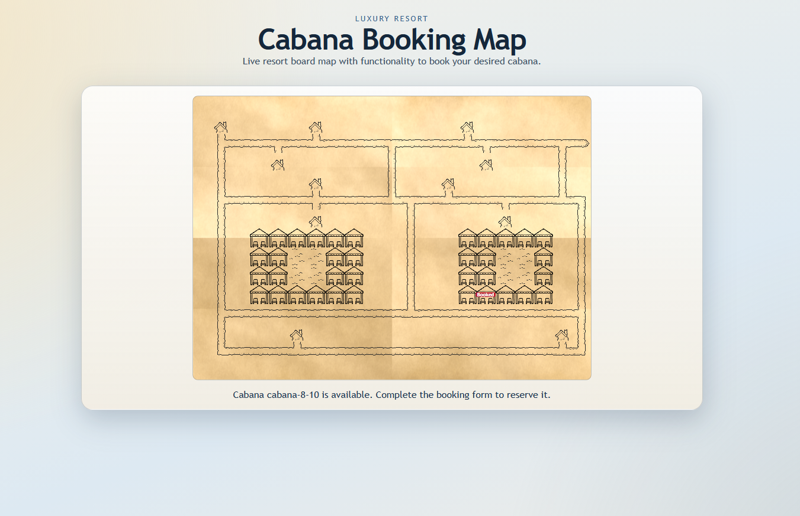
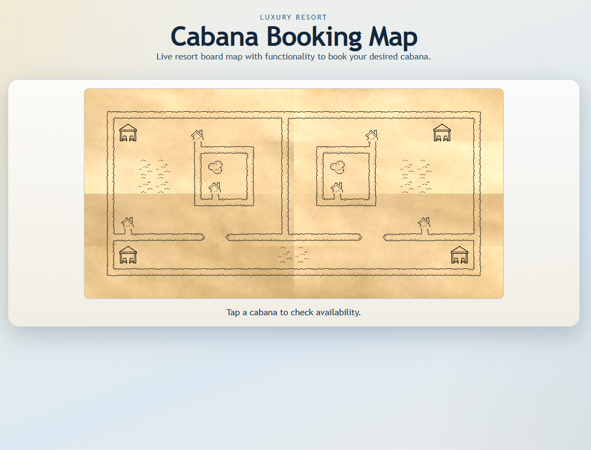
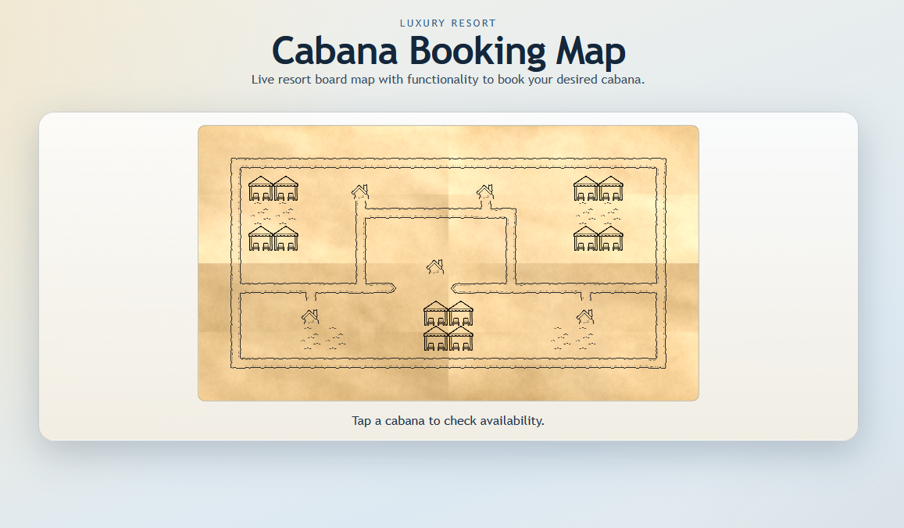
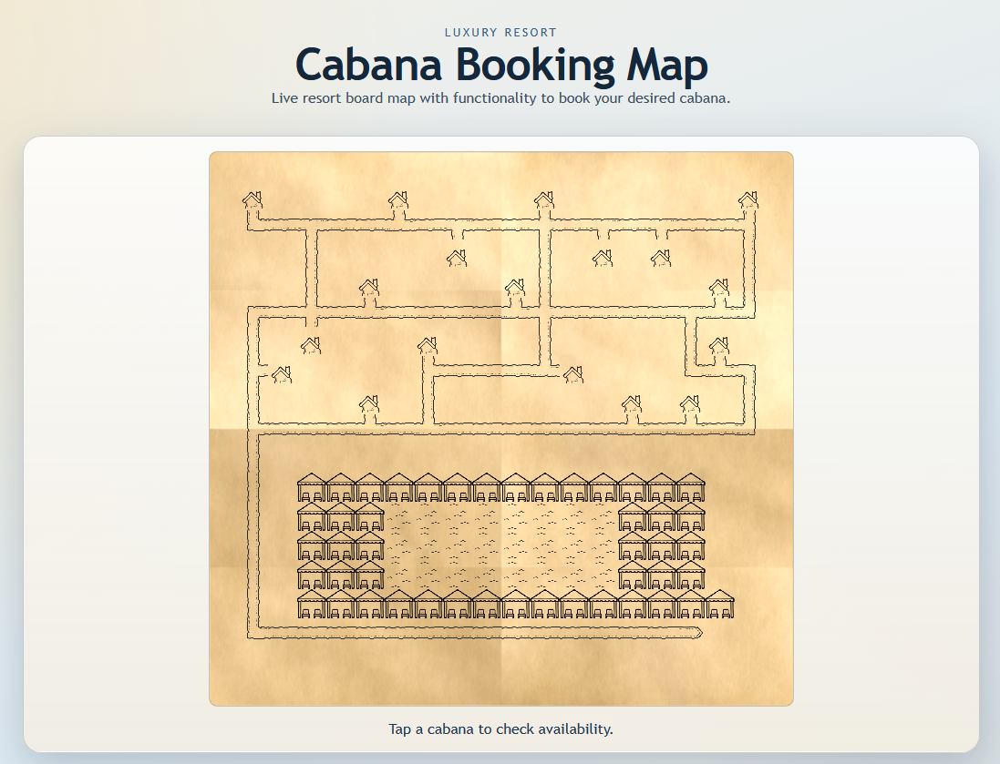
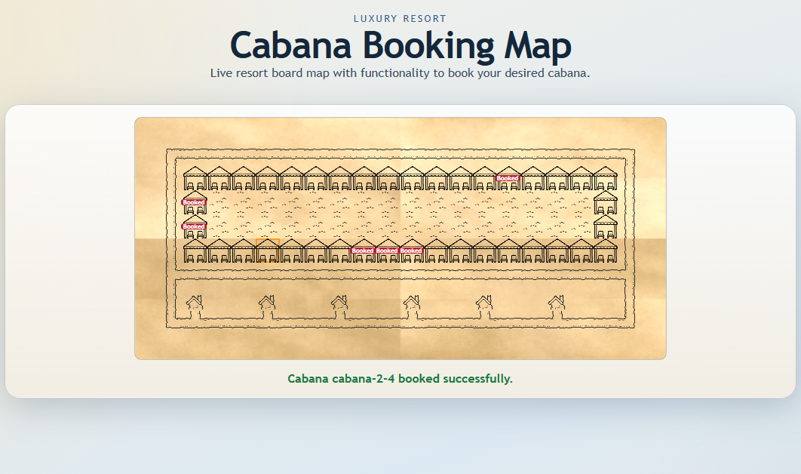
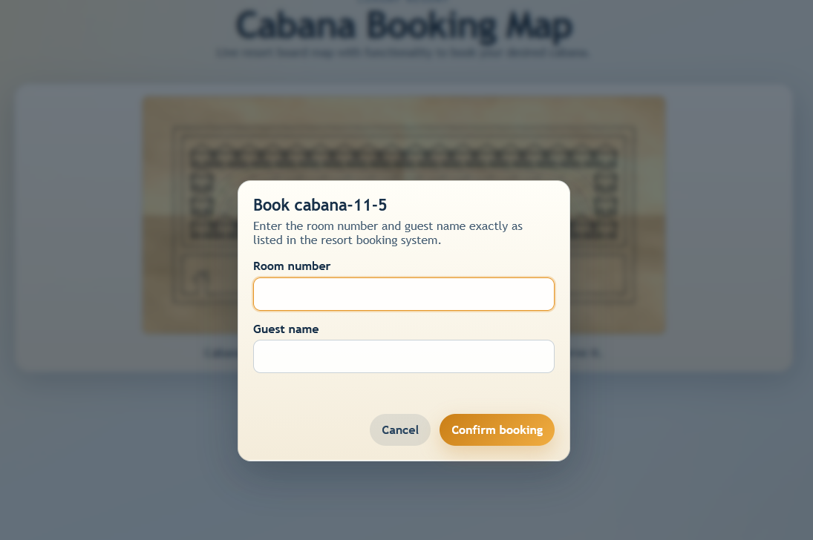

# Cabana Booking Application

This repository contains a small full-stack TypeScript solution for the resort cabana booking challenge described in [GUIDELINES.md](GUIDELINES.md). The app renders an interactive resort map, shows cabana availability, validates guest credentials against the bookings input file, and updates the map immediately after a successful reservation.

## What The App Does

- Displays the resort map from an ASCII file.
- Allows to insert custom API data
- Treats `W` as bookable cabanas, `p` as pool tiles, `#` as paths, `c` as chalets, and `.` as empty space.
- Lets a guest click an available cabana and book it with room number and guest name.
- Rejects invalid bookings when the room number and guest name do not match the provided bookings data.
- Marks booked cabanas as unavailable as soon as the reservation succeeds.
- Allows booking only one cabana per guest. If guest books second cabana, the first one is cancelled.

## Application Overview








collection of testing maps and bookings is prepared in ./testApi folder

## Tech Stack

- Backend: Node.js, TypeScript, Express, Zod
- Frontend: React, TypeScript, Vite
- Testing: Node test runner, Supertest, Vitest, Testing Library
- CI: GitHub Actions in [.github/workflows/ci.yml](.github/workflows/ci.yml)

## Project Structure

- [backend](backend): Express API and booking/map services
- [frontend](frontend): React UI and component tests
- [api](api): default map and bookings input files
- [testApi](testApi): alternative map and bookings fixtures for testing
- [scripts](scripts): root startup and combined test entrypoints

## Installation

Install dependencies in the root package and both app packages:

```bash
npm install
npm --prefix backend install
npm --prefix frontend install
```

## Run The App

Start both backend and frontend from the repository root:

```bash
npm run start
```

The root start command is the single entrypoint required by the challenge. It launches:

- the backend on port `3000`
- the frontend with Vite development server

The command also accepts custom input files:

```bash
npm run start -- --map ./testApi/maps/map2.ascii --bookings ./testApi/bookings/bookings2.json
or:
npm run start --map ./testApi/maps/map2.ascii --bookings ./testApi/bookings/bookings2.json

```

Optional API override for the frontend:

```bash
npm run start -- --api-base-url http://localhost:3000
```

## Run Tests

Run all backend and frontend tests from the repository root:

```bash
npm test
```

Run each side separately when needed:

```bash
npm --prefix backend test
npm --prefix frontend test
```

Build the frontend production bundle:

```bash
npm --prefix frontend run build
```

## API Summary

The backend exposes these endpoints:

- `GET /api`
- `GET /api/map`
- `GET /api/bookings`
- `GET /api/cabanas`
- `POST /api/validate-guest`
- `POST /api/cabanas/:cabanaId/bookings`

## Design Decisions And Trade-Offs

The backend keeps cabana reservations in memory. That matches the challenge requirement and keeps the implementation simple, but reservations reset when the server restarts.

The frontend treats the backend as the source of truth. After a successful booking it refetches the map rather than patching local state in multiple places. That adds one extra request, but it keeps the UI aligned with the API contract and makes booked state easier to trust.

Validation exists on both sides. The frontend validates early to provide faster feedback, while the backend repeats the same checks so invalid requests cannot bypass the rules.

Project structure is divided on separate folders containing reusable components, styling files, service functions, separate tests folders and contains ci.yml file running pipeline. Considering the scale of this application all of the above is not crucial, but leaves much better environment for potential further development

Each developed feature has been provided as separate branch named "feature/(description)" and delivered in several commits atomizing the continous development

## Deliverables Notes

The repository includes:

- a single root startup command via `npm run start`
- automated backend and frontend tests via `npm test`
- AI workflow notes in [AI.md](AI.md)
- CI automation in [.github/workflows/ci.yml](.github/workflows/ci.yml)
- testing maps and bookings in /testApi

## Additional Information

- Map displays "p" field as a pool image only if there is no more "p" fields in X and Y axis in range of 1. Otherwise the "p" field is treated as a part of bigger water container and is displayed as water image. Diagonal "p" neighbours are treated as separate pools.
- Map generator is programmed to draw only one path to chalet prioritizing path from bottom, then from a side and lasty from top.